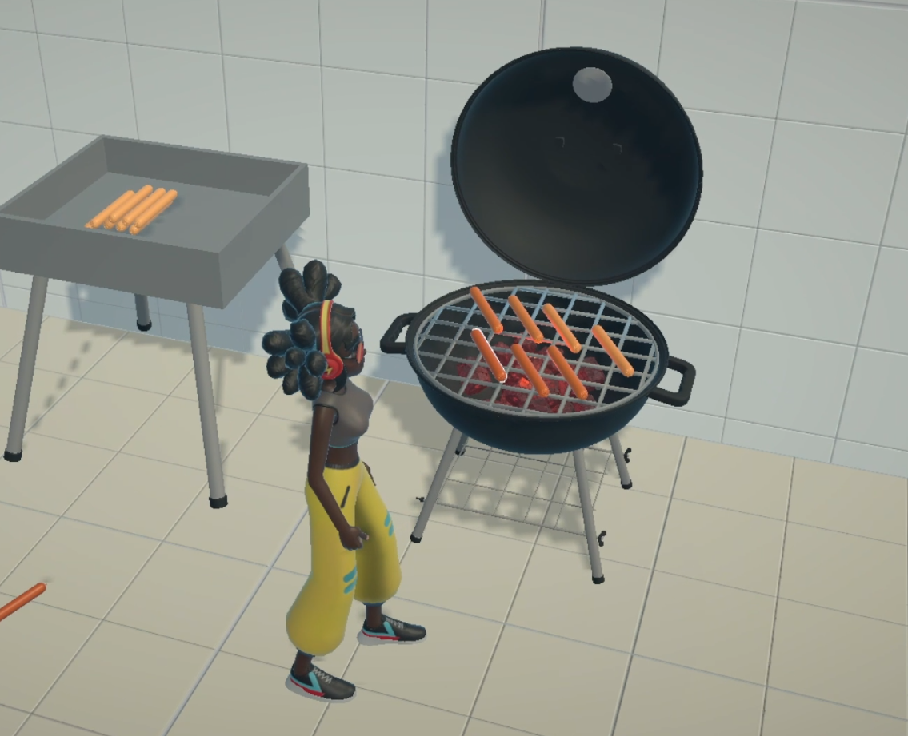

## Hey! Welcome here 👋
I'm Océane, and I'm currently working every weekend on a mini gamejam (more like a gameplay jam). I'll be putting all the results I get here and will only be using open source tools and free assets. Feel free to have a look or use whatever you like.  

   
   
### Theme n°2: SMOKE ☁   
  

### &nbsp;&nbsp;&nbsp; 🛠️ What was done:  
&nbsp;&nbsp;&nbsp;- Setup character controller  
&nbsp;&nbsp;&nbsp;- Grab ability/highlight  
&nbsp;&nbsp;&nbsp;- Snap items/snap areas  
&nbsp;&nbsp;&nbsp;- Sausage cooking, burning  
&nbsp;&nbsp;&nbsp;- Extinguisher  
    
  
 

### 🔨 Tools and assets:
&nbsp;&nbsp;&nbsp;- 3D Model Coal: [sketchfab](https://sketchfab.com/3d-models/coal-c8d2447cc0ed4539aa13dc633596f387#download)  
&nbsp;&nbsp;&nbsp;- 3D Model Extinguisher: [turbosquid](https://www.turbosquid.com/3d-models/free-obj-mode-co2-extinguisher/1109715)  
&nbsp;&nbsp;&nbsp;- 3D Model barbecue: [free3d](https://free3d.com/fr/3d-model/table-top-charcoal-grill-v1--262993.html)  
&nbsp;&nbsp;&nbsp;- 3D Model sausage: [freepik](https://www.freepik.com/3d-models/sausage)  
&nbsp;&nbsp;&nbsp;- SFX barbecue: [freesound](https://freesound.org/people/nebulousflynn/sounds/269089/)  
&nbsp;&nbsp;&nbsp;- SFX fire ignition: [freesound](https://freesound.org/people/kyles/sounds/637533/)  
&nbsp;&nbsp;&nbsp;- SFX extinguisher: [freesound](https://freesound.org/people/Iamgiorgio/sounds/371839/)  
&nbsp;&nbsp;&nbsp;- VFX fire: [unity assetStore](https://assetstore.unity.com/packages/vfx/particles/fire-explosions/procedural-fire-141496)  
  
